# Stock Prediction Using *K*-Nearest Neighbor (*k*NN) Algorithm

I applied k-nearest neighbor algorithm and non-linear regression approach in
order to predict stock proces for a sample of six major companies listed on the
NASDAQ stock exchange to assist investors, management, decision makers, and
users in making correct and informed investments decisions.

A more detailed paper on this can be found in
[final.pdf](files/alldeliverables/final.pdf)

## To run
```
cd <this directory>

pip install -r requirements.txt

python knnAlgorithm.py
```

## Some Stock Market terminologies

**OPEN** is the price of the stock at the beginning of the trading day (it 
need not be the closing price of the previous day).

**High** is the highest price of the stock at closing time.

**Low** is the lowest price of the stock on that trading day.

**Close** is the price of the stock at closing time.

**Volume** indicates how many stocks were traded.

**Adjusted Close** is the closing price of the stock that adjusts the price of 
the stock for corporate actions.

While stock prices are considered to be set mostly by traders, **stock** splits
(when the company makes each extant stock worth two and halves the price) and
**dividends** (payout of company profits per share) also affect the price of a 
stock and should be accounted for.

## *K* Nearest Neighbor (*k*NN) Algorithm

The model for kNN is the entire training dataset. When a prediction is required
for a unseen data instance, the kNN algorithm will search through the training 
dataset for the k-most similar instances. The prediction attribute of the most 
similar instances is summarised and returned as the prediction for the unseen
instance.

The similarity measure is dependent on the type of data. For real-valued data, 
the Euclidean distance can be used. For other types of data, such as categorical
or binary data, Hamming distance can be used.

In the case of regression problems, the average of the predicted attribute may 
be returned.

In case of classification, the most prevalent class may be returned.

### How does it work?
The kNN algorithm belongs to the family of
[instance-based](https://en.wikipedia.org/wiki/Instance-based_learning "In
machine learning, instance-based learning, sometimes called memory-based
learning, is a family of learning algorithms that, instead of performing
explicit generalization, compares new problem instances with instances seen in
training, which have been stored in memory."), [competitive
learning](https://en.wikipedia.org/wiki/Competitive_learning "Competitive
learning is a form of unsupervised learning in artificial neural networks, in
which nodes compete for the right to respond to a subset of the input data. A
variant of Hebbian learning, competitive learning works by increasing the
specialization of each node in the network.")
and [lazy learning](https://en.wikipedia.org/wiki/Lazy_learning "lazy learning
is a learning method in which generalization beyond the training data is
delayed until a query is made to the system, as opposed to in eager learning,
where the system tries to generalize the training data before receiving
queries.") algorithms.

Finally, kNN is powerful because it does not assume anything about the data,
other than that distance measure can be calculated consistently between any two 
instances. As such, it is called *non-linear* as it does not assume a 
functional form.

### Implement kNN
1. Handle data: Open the dataset from CSV and split into test/train datasets
2. Similarity: Calculate the distance between two data instances
3. Neighbors: Locate k most similar data instances
4. Response: Generate a response from a set of data instances
5. Accuracy: Summarize the accuracy of predictions
6. Main: Tie it all together


### Results

The following graphs show the result. We achieved a 70% accuracy in the
prediction. So, a module that will predict, given a stock, will rise tommorow 
will be posted in coming days. For now, enjoy the graphs and be glad that there
now exists a ML algorithm that give 70% certainty on if you should buy a certain 
stock or not.

amtd
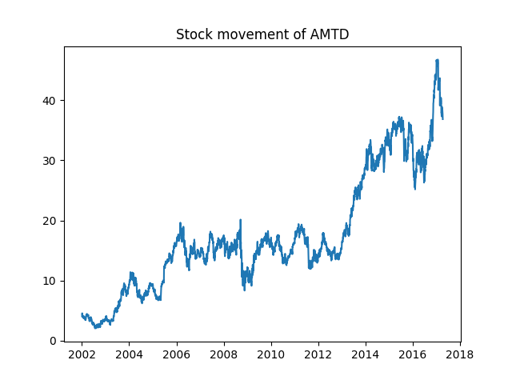 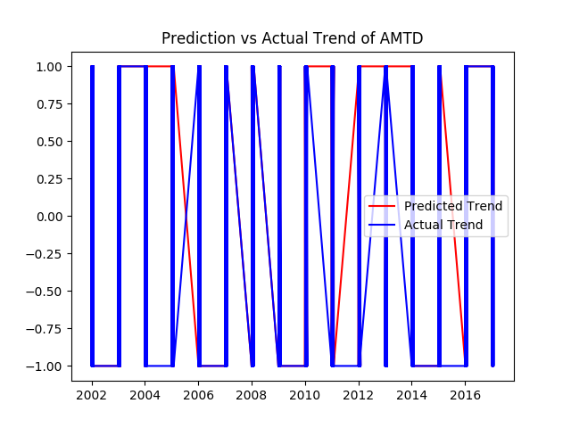 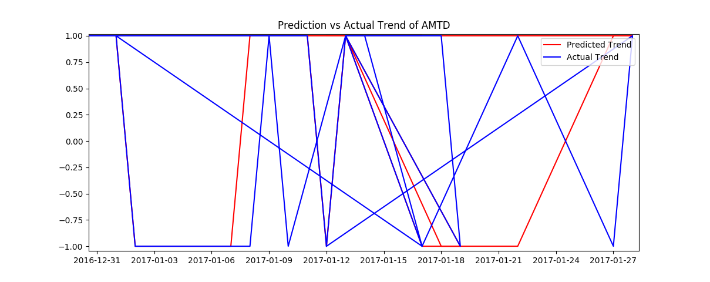
amzn
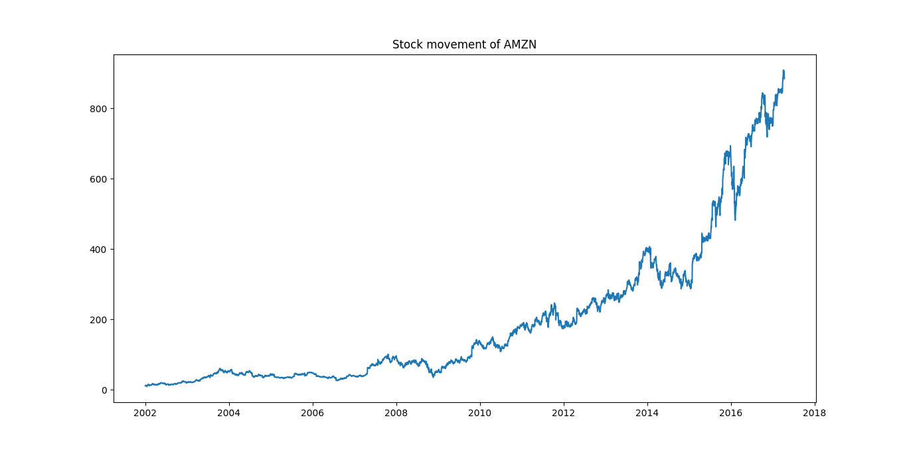  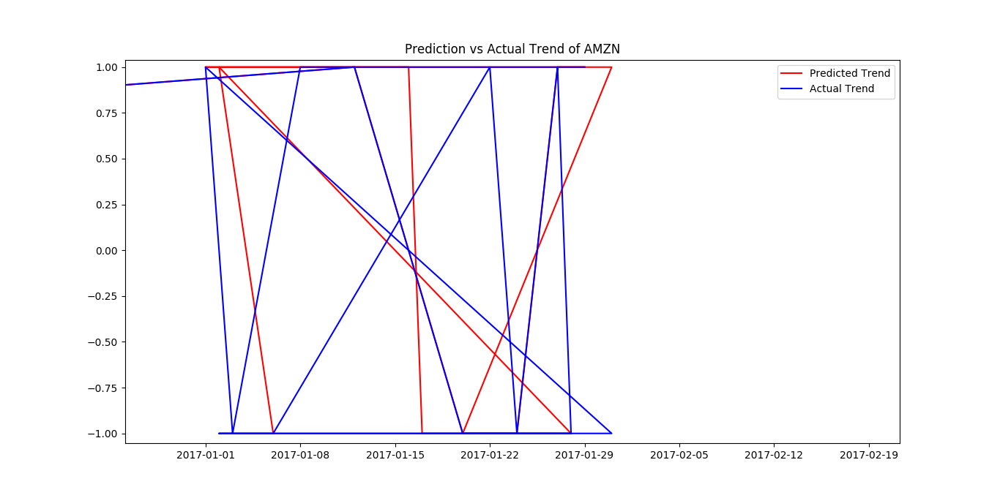
dis
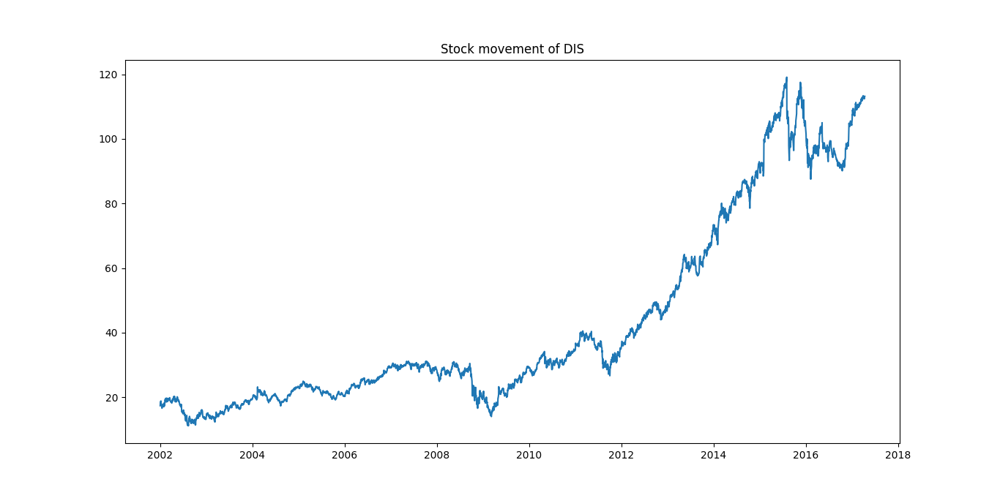 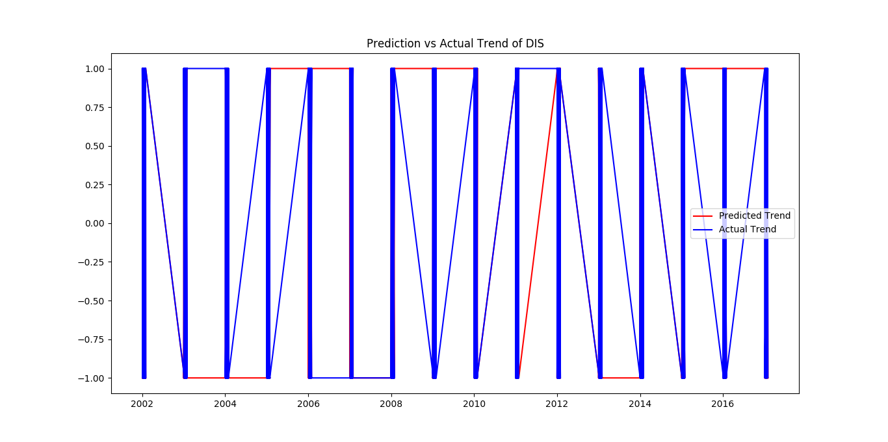 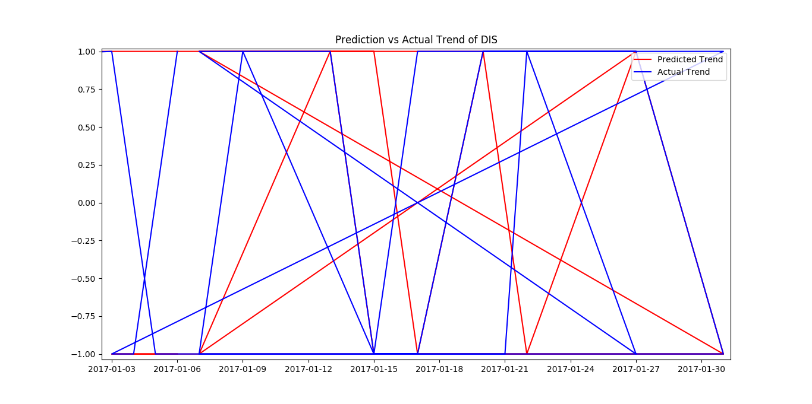
sbux
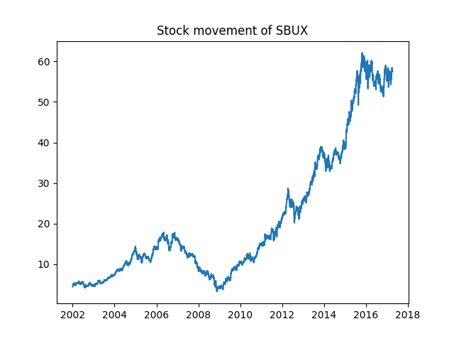 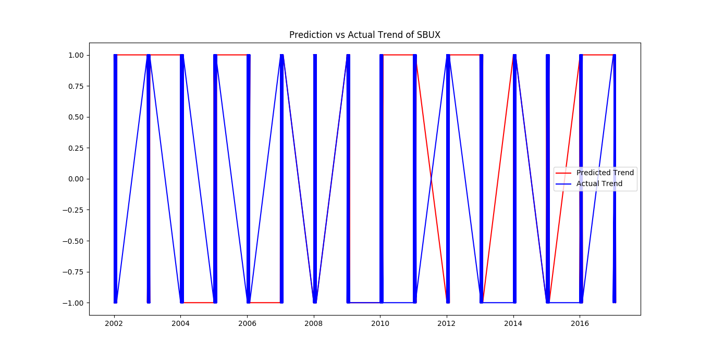 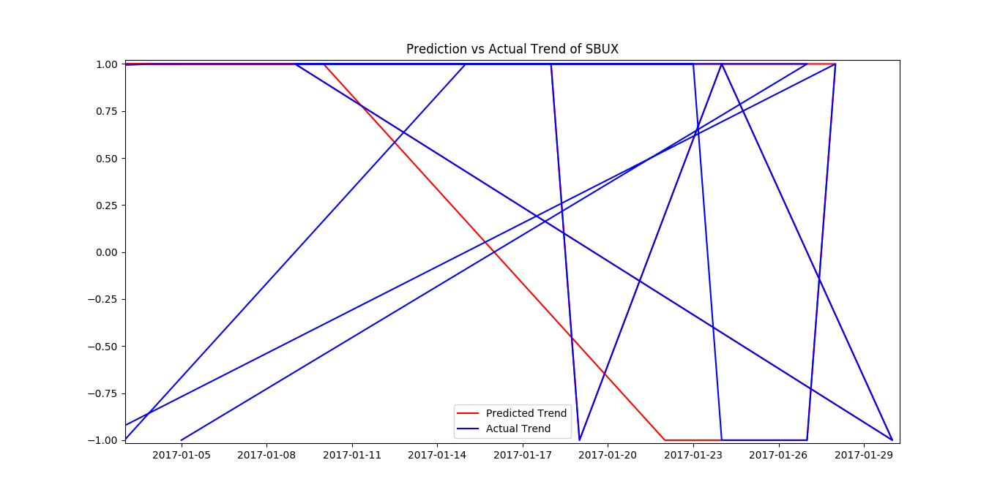
twlo
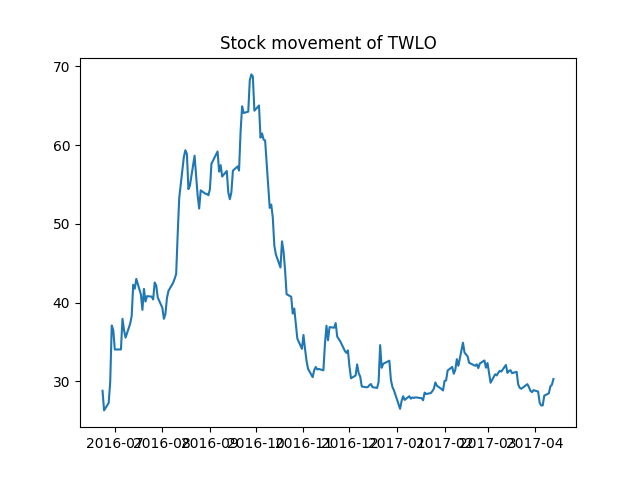 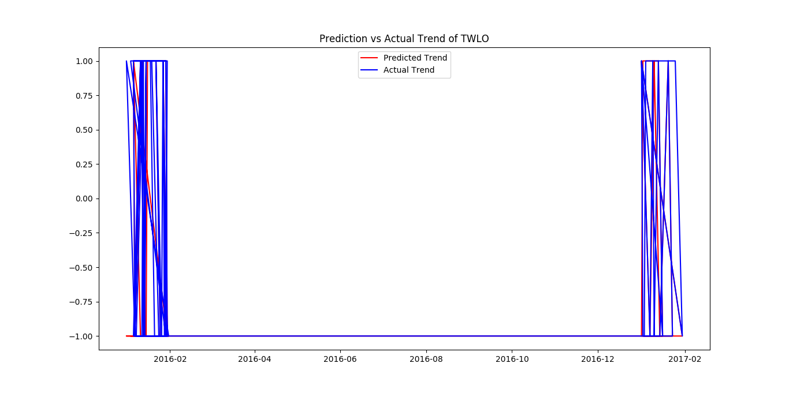 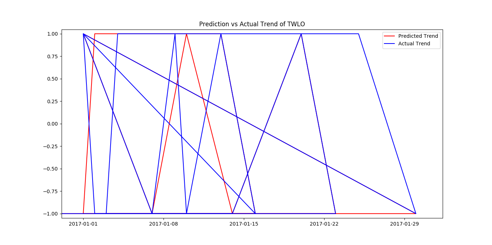
twtr
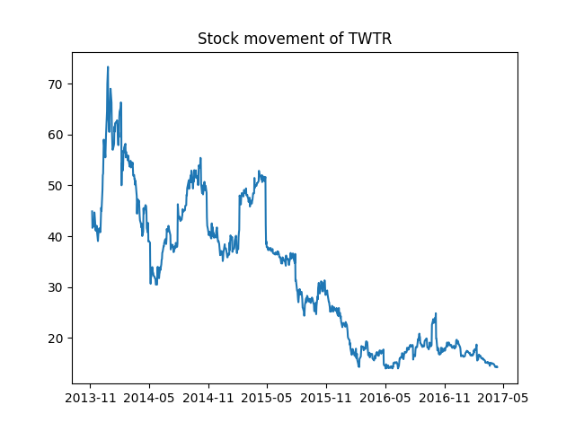 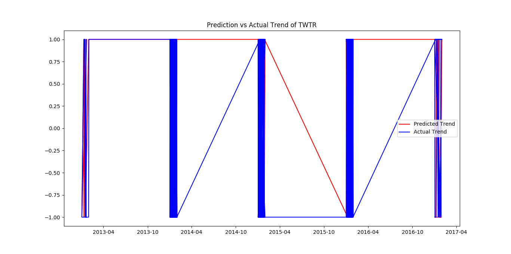 
yhoo
 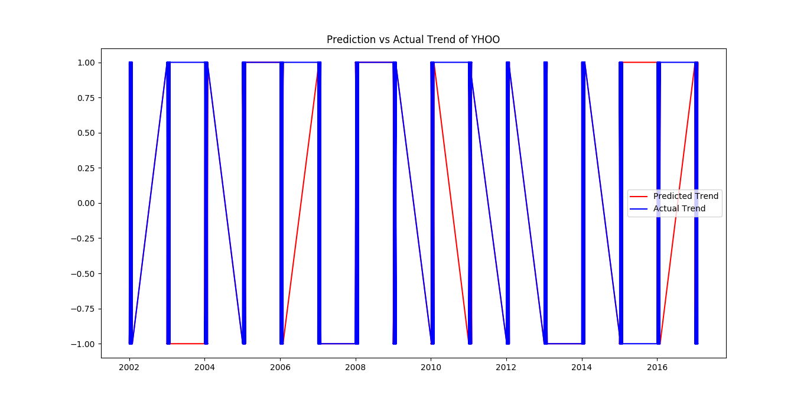 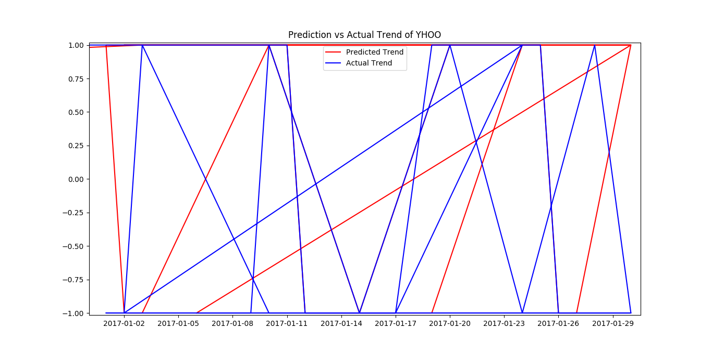

## Reference
[Implement
kNN](http://machinelearningmastery.com/tutorial-to-implement-k-nearest-neighbors-in-python-from-scratch/)


